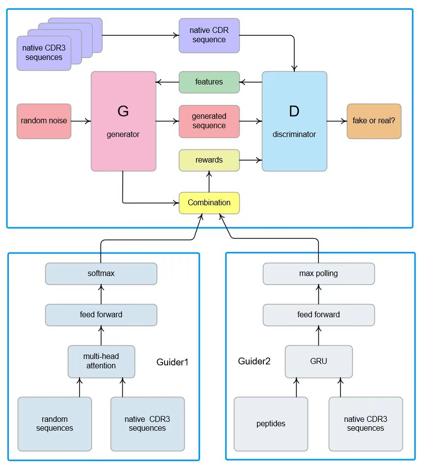

# AiCDR

-----------------------------------------------------------------------------------------------------


AiCDR is generative adversarial network with three discriminators for nanobody CDR3 sequence generation.

Read AiCDR paper:

https://www.biorxiv.org/content/10.1101/2024.10.29.620982v1

AiCDR employs part of the benchmarking platform Texygen, see more:

https://github.com/geek-ai/Texygen


Code organization:
* `main.py` - Main script to initialize and run the AiCDR model.
* `example.sh` - Main script to initialize and run the AiCDR model.
* `utils/` -  Utility functions used by the main script.
* `data/` - Training data for AiCDR.
* `save/` - Files generated during intermediate steps of model training.
* `models/` - Saved AiCDR model checkpoints.
* `Guider1/` - Trained model for random sequence discrimination (Guider1).
* `Guider2/` - Trained model for peptide sequence discrimination (Guider2).
* `Guider/` - Scripts for training and evaluating Guider1 and Guider2.
* `Nanobody_library/` - A library of 5,194 nanobody structures with diverse CDR3 sequences.
* `Epitope_profiling/` - Contains docking results and epitope profiling data for the six target proteins..
-----------------------------------------------------------------------------------------------------
# Usage

Generate CDR3 sequences

* You can build the AiCDR environment through the AiCDR.yaml, the prefix path should be changed to your own path:

  ```
  conda env -f AiCDR.yaml
  ```
* Generating new CDR3 using following command:
  
  ```
  python main.py -g cdrgan -t real -d data/amp.txt
  ```
-----------------------------------------------------------------------------------------------------
Retrain the model

* First, train two Guider networks using your own positive and negative data:
  
  ```
  python Guider1.py
  python Guider2.py 
  ```

* Then, train AiCDR:

  ```
  python main.py -g cdrgan -t real -d <positive dataset location>
  ```
  * `<positive dataset location>` - positive data to train AiCDR
-----------------------------------------------------------------------------------------------------
```
@article{huoliyun2024AiCDR,
  title={Deep generative design of neutralizing nanobodies against SARS-CoV-2 variants},
  author={Liyun Huo, Tian Tian, Yanqin Xu, Qin Qin, Xinyi Jiang, Qiang Huang},
  doi={https://doi.org/10.1101/2024.10.29.620982},
  year={2024},
}
```
-----------------------------------------------------------------------------------------------------
